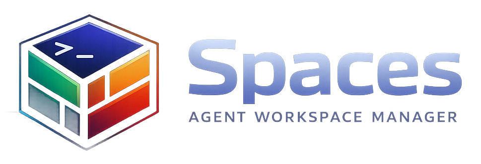
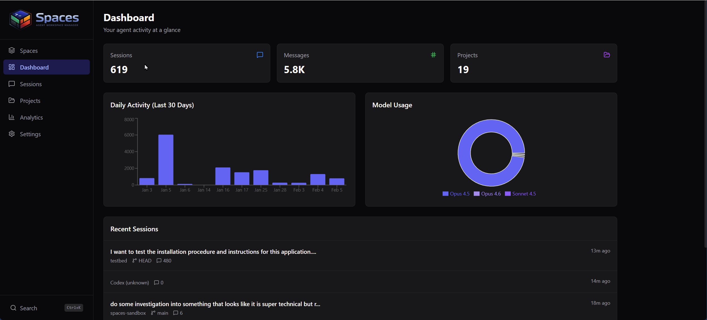

<p align="center">
  
</p>

<h3 align="center">The workspace manager for AI coding agents</h3>

<p align="center">
  Run Claude Code, Codex CLI, Gemini CLI, Aider, or any agent side-by-side<br/>
  in a browser-based terminal grid. Totally free. Totally open source.
</p>

<p align="center">
  <a href="#quick-start">Quick Start</a> &middot;
  <a href="#features">Features</a> &middot;
  <a href="docs/getting-started.md">Full Docs</a>
</p>

<p align="center">
  <a href="https://www.npmjs.com/package/@jlongo78/agent-spaces"></a>
  <a href="https://github.com/jlongo78/spaces/actions/workflows/ci.yml"></a>
  <a href="LICENSE"></a>
  
  
</p>

<p align="center">
  
</p>

---

## What is Spaces?

Most AI coding agents are powerful but isolated — one terminal, one session, one agent at a time. **Spaces** changes that.

Open your browser and get a full terminal grid where every pane is a real PTY. Spin up Claude in one pane, Codex in another, a plain shell in a third. Group them into named workspaces. Search across every session you've ever had. See your usage stats at a glance.

Everything runs locally. Your data never leaves your machine.

## Quick Start

### Install from npm (recommended)

```bash
npm install -g @jlongo78/agent-spaces
spaces
```

### Or build from source

```bash
git clone https://github.com/jlongo78/spaces.git
cd spaces
npm install
npm run build
npm start
```

Open [http://localhost:3457](http://localhost:3457) and start adding panes.

## Features

### Terminal Multiplexer
Split your browser into a grid of terminal panes. Each one runs a real PTY streamed over WebSocket to xterm.js — not a toy emulator.

### Agent-Agnostic
First-class support for **Claude Code**, **Codex CLI**, **Gemini CLI**, **Aider**, any custom command, and plain shell. Pick your agent per-pane from a dropdown.

### Workspaces
Group panes into named, color-coded spaces. Working on the frontend and the API at the same time? Give each its own workspace and switch instantly.

### Session Browser
Every agent session (Claude, Codex, Gemini, Aider) is indexed automatically. Browse, search, and filter with full-text search powered by SQLite FTS5. Jump back into any conversation.

### Dashboard & Analytics
Session counts, token usage breakdown by model, activity heatmap, and cost estimates — all computed locally from your `~/.claude/` data.

### Everything Local
Zero cloud dependencies. No accounts. No telemetry by default. All data lives in `~/.claude/` (read-only) and `~/.spaces/` (auto-created). Fully offline-capable.

## Advanced Tiers

The Community edition above is fully open source (AGPL-3.0) and free forever. For teams and organizations, Spaces also supports multi-user auth, admin panels, federated node networks, and remote workspaces through optional paid tiers.

| | Community | Server | Team | Federation |
|---|:---------:|:------:|:----:|:----------:|
| Multi-pane terminals | Yes | Yes | Yes | Yes |
| Session browser & search | Yes | Yes | Yes | Yes |
| Dashboard & analytics | Yes | Yes | Yes | Yes |
| Browser access | Yes | Yes | Yes | Yes |
| Login & TOTP auth | - | Yes | Yes | Yes |
| Multi-user accounts | - | - | Yes | Yes |
| Admin panel | - | - | Yes | Yes |
| Federated node network | - | - | - | Yes |
| Remote workspaces | - | - | - | Yes |
| mDNS auto-discovery | - | - | - | Yes |

See [docs/tiers.md](docs/tiers.md) for details.

## Tech Stack

| Layer | Technology |
|-------|------------|
| Framework | Next.js 16 (App Router) |
| UI | React 19, Tailwind CSS, Lucide icons |
| Database | SQLite via better-sqlite3, FTS5 full-text search |
| Terminal | xterm.js + node-pty over WebSocket |
| Runtime | Node.js (CLI) |

## Configuration

| Variable | Default | Description |
|----------|---------|-------------|
| `SPACES_PORT` | `3457` | Web UI port |
| `SPACES_WS_PORT` | `3458` | Terminal WebSocket port |
| `NEXT_PUBLIC_TIER` | `community` | Product tier |

Data lives in:
- **`~/.claude/`** — Claude Code sessions (read-only)
- **`~/.codex/`** — Codex CLI sessions (read-only)
- **`~/.gemini/`** — Gemini CLI sessions (read-only)
- **`.aider.chat.history.md`** — Aider sessions in each project directory (read-only)
- **`~/.spaces/`** — Spaces database and config (auto-created)

## Contributing

Contributions are welcome. Please open an issue first to discuss what you'd like to change.

## License

[AGPL-3.0](LICENSE)
